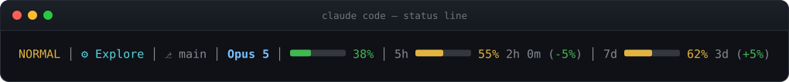
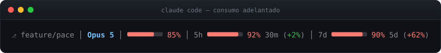
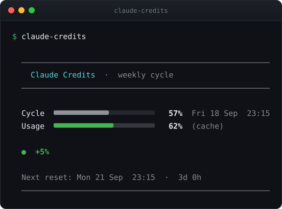

# dotfiles

Status line para [Claude Code](https://claude.ai/code) con control de ritmo de
consumo, más una herramienta de consulta para el ciclo semanal.



De izquierda a derecha: modo vim, agente activo, worktree, modelo, ventana de
contexto, límite de 5 horas y límite de 7 días. Los dos últimos añaden el tiempo
que queda hasta el reinicio y, entre paréntesis, el **delta de ritmo**: cuánto se
adelanta (o atrasa) el consumo respecto a lo transcurrido del ciclo.

- `-5%` verde → vas por debajo del ritmo, el crédito llega de sobra.
- `+5%` verde → vas justo en ritmo.
- `+12%` ámbar → vas adelantado, conviene moderar.
- `+20%` rojo → a este ritmo el crédito se acaba antes que el ciclo.

Las barras se tiñen de ámbar al 50% de uso y de rojo al 80%, así que una
semana torcida se ve de un vistazo:



## Instalación

**macOS / Linux**

```bash
curl -fsSL https://raw.githubusercontent.com/amsylhar/dotfiles/master/claude-statusline-install.sh | bash
```

**Windows (PowerShell)**

```powershell
irm https://raw.githubusercontent.com/amsylhar/dotfiles/master/claude-statusline-install.ps1 | iex
```

Reinicia Claude Code para que la status line aparezca.

El instalador escribe `~/.claude/statusline-command.sh` (o `.ps1`) y añade la
clave `statusLine` a `~/.claude/settings.json`, **conservando** el resto de la
configuración y dejando antes una copia `settings.json.bak.<fecha>`. Si ese
archivo existe pero no es JSON válido, el instalador aborta sin tocarlo.

### jq

La versión de macOS/Linux necesita `jq` para leer el JSON que Claude Code le
pasa. Si no está instalado:

1. se instala con Homebrew si lo tienes, o
2. se descarga el binario estático oficial de jq a `~/.claude/bin/jq`,
   verificando su SHA-256 antes de usarlo (sin root, se desinstala borrando esa
   carpeta).

Si ninguna de las dos cosas es posible, el instalador dice cómo instalarlo a
mano y no toca nada. La versión de Windows no necesita jq: usa
`ConvertFrom-Json`.

## Actualizar

Vuelve a ejecutar el mismo comando de instalación. Reinstalar **es** la vía de
actualización, y solo toca lo que ha cambiado:

- Reescribe `statusline-command.sh` (o `.ps1`) solo si el contenido cambió, y te
  dice cuál de las tres cosas pasó: instalada, actualizada o ya al día.
- No toca `settings.json` si ya apunta a la status line, así que reinstalar no
  va dejando copias `.bak` sueltas. Solo hace copia cuando de verdad va a
  modificarlo.
- Respeta lo que ya tienes: el `jq` de `~/.claude/bin` si lo instaló antes, la
  caché de créditos y el resto de tu configuración.

Después de una actualización hay que reiniciar Claude Code; el propio instalador
lo dice solo cuando hace falta.

`claude-credits` es un archivo suelto en `/usr/local/bin`: se actualiza
repitiendo el `curl` de más abajo.

## claude-credits

Consulta detallada del ciclo semanal, leyendo la caché que escribe la status
line (`~/.claude/credits-cache`):

```bash
sudo curl -fsSL https://raw.githubusercontent.com/amsylhar/dotfiles/master/claude-credits -o /usr/local/bin/claude-credits
sudo chmod +x /usr/local/bin/claude-credits
```



`claude-credits 40` fuerza un porcentaje sin usar la caché. Si la caché es de un
ciclo que ya se reinició, lo avisa en lugar de dar un veredicto con datos
viejos.

Variables opcionales, usadas solo si la caché no trae la fecha de reinicio:
`CLAUDE_RESET_DOW` (1=lunes … 7=domingo, por defecto 4) y `CLAUDE_RESET_HOUR`
(0-23, por defecto 17).

## Ajustar los umbrales

Los colores salen de cuatro constantes, agrupadas al principio de cada script
(`USAGE_WARN`, `USAGE_CRIT`, `PACE_OK`, `PACE_WARN`). Están en los tres
archivos: si cambias uno, cambia los otros.

| Constante | Por defecto | Qué hace |
|---|---|---|
| `USAGE_WARN` | 50 | % de uso a partir del cual la barra se pone ámbar |
| `USAGE_CRIT` | 80 | % de uso a partir del cual la barra se pone roja |
| `PACE_OK` | 5 | delta máximo que sigue considerándose en ritmo (verde) |
| `PACE_WARN` | 15 | delta máximo antes de pasar a rojo |

## Desinstalar

Quita la clave `statusLine` de `~/.claude/settings.json` (o restaura uno de los
`.bak`) y borra `~/.claude/statusline-command.sh`, `~/.claude/credits-cache` y,
si lo instaló, `~/.claude/bin`.

## Las imágenes de este README

Se generan a partir de la salida real de los scripts, no a mano:

```bash
printf '<json de Claude Code>' | bash ~/.claude/statusline-command.sh > salida.ansi
python3 assets/ansi2svg.py salida.ansi assets/statusline.svg "claude code — status line"
```

El conversor lee los códigos de color ANSI y los dibuja como SVG: los textos y
los colores son los que imprime el script, y las barras `█░` y los separadores
`─` se dibujan como formas en vez de como caracteres. Eso es a propósito —
cuando se dejan como texto, cada navegador los saca de una fuente distinta y las
barras salen descuadradas.
